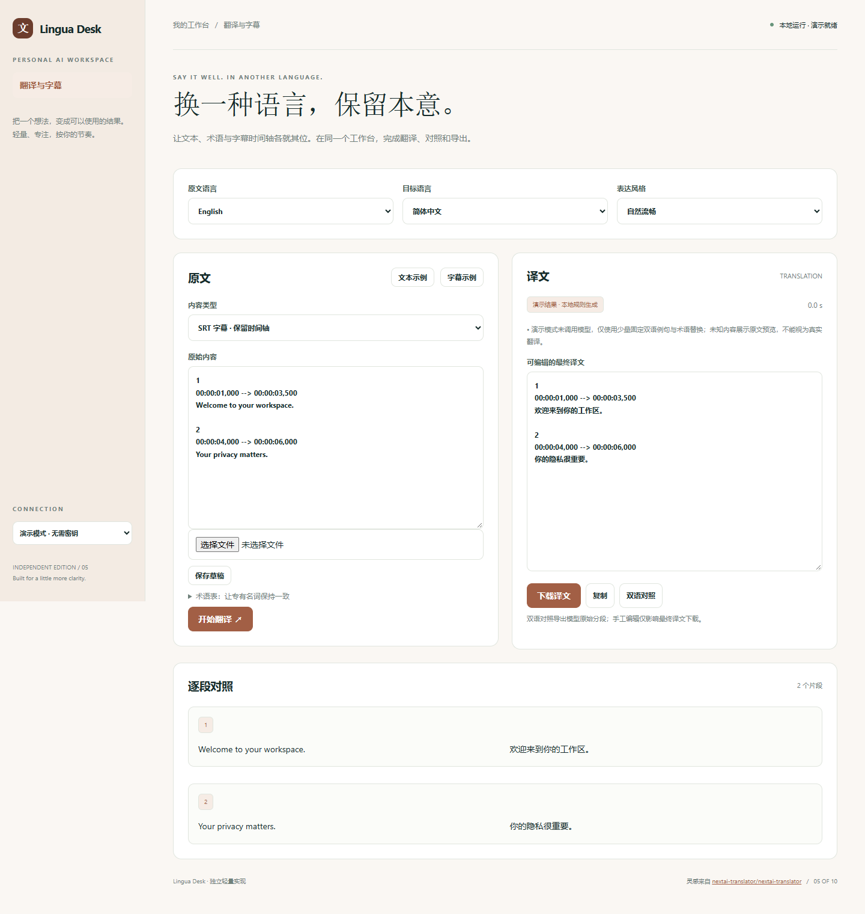

# Lingua Desk

让文本、术语与字幕时间轴各就其位。在同一个工作台，完成翻译、对照和导出。

- 五种目标语言与自然/正式/直译风格
- 逐段双语对照和自定义术语表
- SRT 编号、时间轴与字幕段落保留
- TXT/SRT 导入、译文编辑、双语 Markdown 导出



## 快速开始

需要 Node.js 24 或更新版本；无第三方运行依赖，无需 npm install。

```sh
git clone https://github.com/Yiwen-Yang-BA/chatgpt-lingua-desk.git
cd chatgpt-lingua-desk
npm start
```

打开 http://127.0.0.1:3105 。默认进入**演示模式**，不调用 API，界面会明确标识规则生成的演示结果。

### 接入真实模型

复制 `.env.example` 为 `.env`，填写 `OPENAI_API_KEY`，按账号权限设置 `OPENAI_MODEL`，然后重启服务并切换界面中的「真实模型」。`OPENAI_BASE_URL` 必须支持 OpenAI Responses API；仅兼容 Chat Completions 的服务不适用。密钥只在服务端读取，不写入前端或仓库。

```sh
# Docker（可选；必须显式传入配置）
docker build -t chatgpt-lingua-desk .
docker run --rm -p 127.0.0.1:3105:3105 --env-file .env chatgpt-lingua-desk
```

## 使用方法

1. 粘贴文字或导入 TXT/SRT，选择源语言和目标语言。
2. 用「原词 = 译词」填写术语表，一行一项。
3. 开始翻译，查看逐段对照与术语检查提醒。
4. 可编辑最终译文，导出 TXT/SRT 或原始逐段双语对照 Markdown。

## 验证

```sh
npm run check
npm test
```

测试覆盖业务规则以及本地 HTTP 服务、模拟模型接口、输入校验和错误处理。真实付费模型调用需要用户配置有效密钥，未将演示测试作为真实模型质量验证。GitHub Actions 在每次推送时运行检查。

## 参考与复刻范围

灵感来自 [nextai-translator/nextai-translator](https://github.com/nextai-translator/nextai-translator)（AGPL-3.0）。查询快照：2026-10-04；24,996 stars；最近推送 2026-09-03。这是当前星标量与更新状态，**不是近一个月新增星标排名**。

本仓库是对其核心交互和用途的独立轻量实现，未复制上游源码、商标或静态资源，不声称实现上游的全部功能，也不属于上游官方产品。

复刻 NextAI Translator 的翻译与术语控制核心功能，并增加轻量 SRT 处理。没有桌面取词、OCR、浏览器扩展或语音合成。离线演示仅展示已内置的少量样例，其余内容明确标为原文预览；真实翻译须配置 API。

## 数据与部署边界

当前草稿及术语表可手动保存到浏览器本地；翻译结果仅保留在当前页面，需及时导出。 演示模式数据不离开本机；真实模式会将本次输入发送至所配置的模型服务。

默认只监听 127.0.0.1，适用于单人本地使用；没有多用户登录或持久数据库。如需公网部署，请先增加身份验证、配额和 HTTPS。服务限制请求大小、并发和超时，禁止从静态目录读取密钥文件。

接口实现依据 [OpenAI 官方文本生成文档](https://developers.openai.com/api/docs/guides/text)。

## License

MIT — independent implementation.
